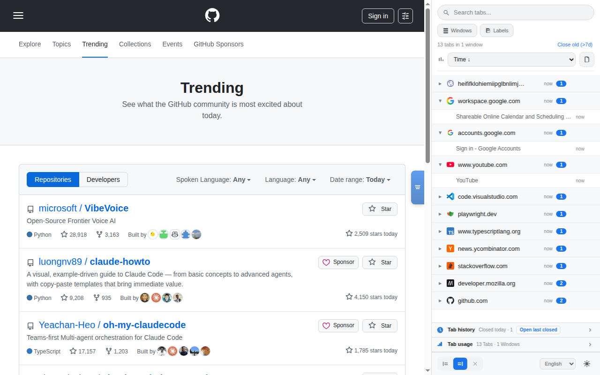
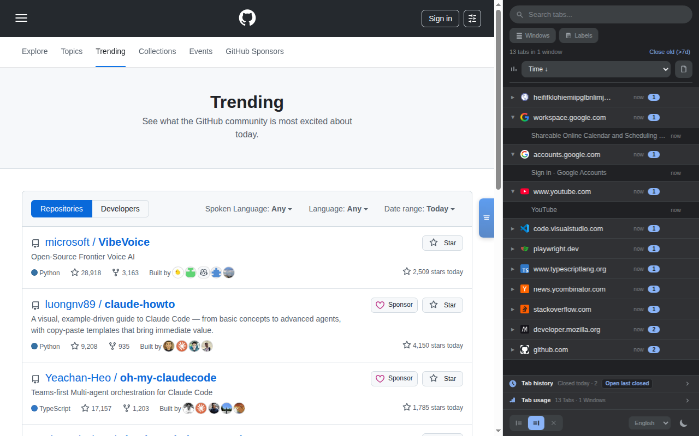
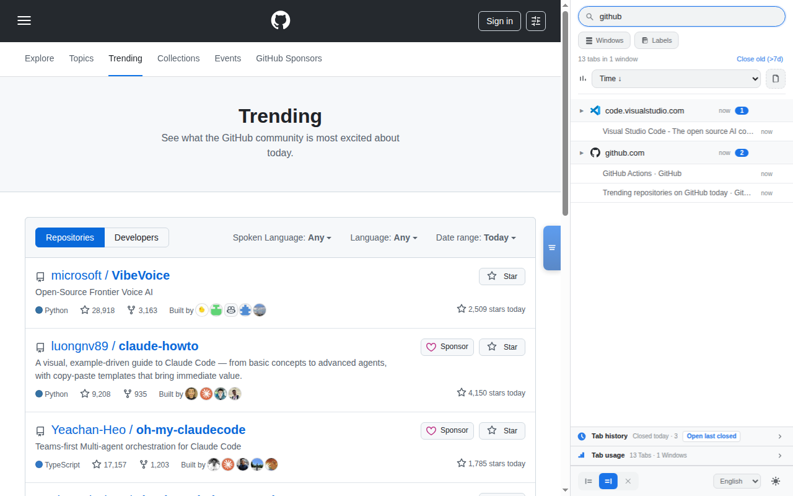
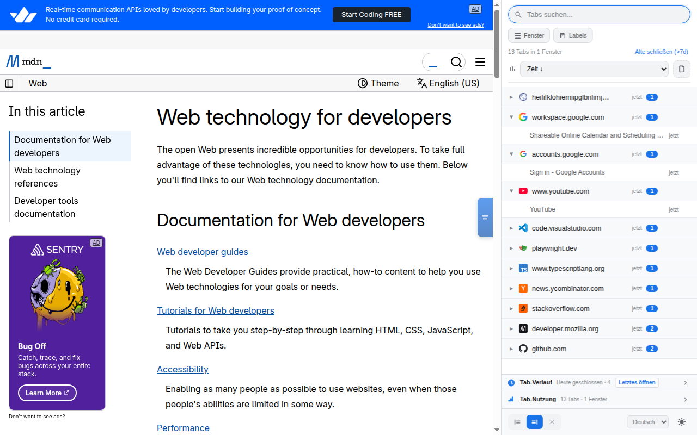

# Tab Manager - Chrome Extension

A Chrome Side Panel extension that groups all your open tabs by domain, sorted by most recently accessed. Designed for users who work with many tabs and need a better way to stay organized.

<p align="center">
  
</p>

<p align="center">
  
</p>

### Search & Multi-Language

<p align="center">
  
  
</p>

## Features

- **Domain grouping** — Tabs are grouped by website domain in an accordion layout
- **Sorted by recency** — Most recently accessed domains and tabs appear at the top
- **Cross-window support** — See tabs from all Chrome windows in one place
- **Window grouping toggle** — Optionally group tabs by window, or mix them all together
- **Window filter** — Filter to show only tabs from a specific window
- **Search** — Filter tabs by title, URL, or page labels in real-time
- **Page labels** — Extracts meta tags (description, keywords, Open Graph, article tags) from pages and displays them on tab rows; toggleable via the **Labels** button
- **Tab sorting** — Sort tabs by title (A–Z / Z–A) or by last accessed time (newest / oldest); persisted across sessions
- **Merge duplicates** — Close extra tabs per domain, keeping only one (active or most recent) with confirmation
- **Custom domain names** — Rename any domain group (e.g. "github.com" → "Code") for faster visual recognition; names persist across sessions, sync to Chrome tab groups, and are searchable
- **Local IP detection** — Local addresses (localhost, 192.168.x.x, 10.x.x.x, etc.) show the page title as domain header instead of the raw IP, with the address visible on hover and as a secondary tab label
- **Chrome tab grouping** — Group all tabs of a domain into a native Chrome tab group with one click, with automatic color coding and domain name labels; works across multiple windows simultaneously
- **Close actions** — Close individual tabs, all tabs of a domain, or all tabs older than 7 days
- **Keyboard shortcut** — `Cmd+M` (Mac) / `Ctrl+M` (Windows/Linux) to toggle the side panel
- **Quick-open banner** — Clickable banner on the page edge to open/close the panel, configurable (left/right/off)
- **Light & dark theme** — Follows your system theme automatically, with a manual toggle
- **Multi-language** — English, German, French, and Spanish (auto-detected from browser, switchable)
- **Tab history** — Reopen recently closed tabs and windows (Chrome sessions list)
- **Tab usage** — Dashboard counts and a per-tab table (window, position, load status, last active, tracked-since, badges)
- **Live updates** — The tab list updates automatically when you open, close, or switch tabs
- **Incognito support** — Can display incognito tabs when enabled

## Installation

### From Chrome Web Store

Install directly from the [Chrome Web Store](https://chromewebstore.google.com/detail/tab-manager/maloipbklbokfhfnfpombeeaoalomlcd) — updates are delivered automatically.

### For Development

1. Clone or download this repository
2. Open `chrome://extensions` in Chrome
3. Enable **Developer mode** (toggle in the top right)
4. Click **Load unpacked**
5. Select the `extension/` folder
6. Click the extension icon in the toolbar to open the Side Panel

### Incognito tabs

To include incognito tabs in the list:

1. Go to `chrome://extensions`
2. Click **Details** on "Tab Manager"
3. Enable **Allow in Incognito**

> **Note:** Chrome extensions can only access tabs within their own profile. Tabs from other Chrome profiles are not visible — this is a Chrome security limitation.

### Permissions

Chrome lists these when you install or update the extension:

- **tabs**, **tabGroups**, **sidePanel**, **storage**, **sessions** — tab list, native groups, panel, settings, and recently closed sessions for Tab history

## Usage

| Action | How |
|--------|-----|
| Open the panel | Click the extension icon in the toolbar |
| Open/close via shortcut | `Cmd+M` (Mac) / `Ctrl+M` (Windows/Linux) |
| Open/close via banner | Click the edge banner on the page |
| Configure banner position | Left/Right/Off buttons in the panel |
| Switch to a tab | Click on it in the list |
| Close a tab | Hover and click the **x** button |
| Group tabs by domain | Hover the domain header and click the **folder icon** |
| Ungroup tabs | Hover a grouped domain and click the **folder-minus icon** |
| Rename a domain | Hover the domain header and click the **pencil icon**, type a custom name, press Enter |
| Reset a domain name | Rename it to empty or back to the original hostname |
| Close all tabs of a domain | Hover the domain header and click **Close all** |
| Close old tabs | Click **Close old (>7d)** in the header |
| Search | Type in the search field |
| Sort tabs | Use the sort dropdown (A–Z, Z–A, Time ↑, Time ↓) |
| Toggle page labels | Click the **Labels** button in the toolbar |
| Merge duplicate tabs | Click the **merge icon** in the header |
| Filter by window | Use the window dropdown |
| Group by window | Toggle the **Windows** button |
| Switch theme | Click the sun/moon icon |
| Change language | Use the language dropdown |

## Tech Stack

- Chrome Extension Manifest V3
- Vanilla JavaScript, HTML, CSS
- No external dependencies
- CSS custom properties for theming
- [Playwright](https://playwright.dev/) for E2E testing

## Project Structure

```
├── extension/                              # Chrome Extension (load this in chrome://extensions)
│   ├── manifest.json                       # Extension manifest (Manifest V3)
│   ├── background.js                       # Service worker entry point
│   ├── core/
│   │   ├── i18n.js                         # Translations (en, de, fr, es)
│   │   ├── models.js                       # JSDoc type definitions
│   │   └── background/
│   │       ├── main.js                     # Tab events, storage, message handlers
│   │       └── dev-hot-reload.js           # Dev-mode file watcher reload
│   ├── features/
│   │   ├── tab-browser/
│   │   │   ├── sidepanel.html              # Side panel markup
│   │   │   ├── sidepanel.css               # Styles with light/dark theme
│   │   │   ├── sidepanel.js                # UI logic, rendering, event handling
│   │   │   ├── banner.js                   # Content script: edge banner
│   │   │   ├── banner.css                  # Banner styling
│   │   │   └── page-meta-labels.js         # Content script: meta tag extraction
│   │   ├── tab-history/
│   │   │   └── tab-history.js              # Recently closed tabs/windows
│   │   └── tab-usage/
│   │       └── tab-usage.js                # Tab usage dashboard + table
│   └── icons/
│       ├── icon16.png
│       ├── icon48.png
│       └── icon128.png
├── tests/                                  # Playwright E2E tests (116 tests)
│   ├── fixtures.js                         # Chrome + Extension launch fixture
│   ├── custom-domain-names.spec.js         # Custom domain names (7 tests)
│   ├── sidepanel.spec.js                   # Core UI (12 tests)
│   ├── tab-grouping.spec.js                # Chrome tab groups (17 tests)
│   ├── close-actions.spec.js               # Close actions (8 tests)
│   ├── search.spec.js                      # Search (7 tests)
│   ├── window-management.spec.js           # Window management (7 tests)
│   ├── toggle-panel.spec.js                # Panel toggle (7 tests)
│   ├── tab-usage.spec.js                   # Tab usage (7 tests)
│   ├── service-worker.spec.js              # Service worker (6 tests)
│   ├── i18n.spec.js                        # Language switching (6 tests)
│   ├── tab-history.spec.js                 # Tab history (5 tests)
│   ├── banner.spec.js                      # Edge banner (5 tests)
│   ├── sorting.spec.js                     # Tab sorting (4 tests)
│   ├── merge-duplicates.spec.js            # Merge duplicates (4 tests)
│   ├── local-ip-detection.spec.js          # Local IP detection (4 tests)
│   └── theme.spec.js                       # Theme (4 tests)
├── scripts/
│   ├── build.js                            # Build extension ZIP
│   ├── screenshots.js                      # Generate store screenshots
│   ├── dev-watch.js                        # File watcher for hot reload
│   ├── launch-browser-dev.js               # Launch browser for dev
│   └── resolve-browser.js                  # Browser path resolution
├── .github/workflows/
│   ├── test.yml                            # E2E tests on PRs
│   ├── screenshots.yml                     # Screenshot generation (PRs + manual)
│   └── publish.yml                         # Chrome Web Store publish on tags
├── playwright.config.js
├── package.json
└── README.md
```

## Testing

The project includes an end-to-end test suite using [Playwright](https://playwright.dev/) that loads the extension in a real Chrome browser.

```bash
npm install                      # Install dependencies
npm run test:e2e                 # Run all E2E tests (Playwright)
npx playwright test --headed     # Run with visible browser
npx playwright test --ui         # Interactive UI mode
```

`npm test` does not run the suite; it prints a reminder to use `npm run test:e2e`.

### Test Coverage (116 tests)

| Test file | Tests | Feature |
|-----------|------:|---------|
| `tab-grouping.spec.js` | 17 | Tab Grouping (single/multi-window, color badge, edge cases) |
| `sidepanel.spec.js` | 12 | Core UI (tab list, grouping, accordion, active tab, usage, history) |
| `close-actions.spec.js` | 8 | Close Actions (hover, close all, close old, confirm/cancel) |
| `window-management.spec.js` | 7 | Window Management (filter, grouping toggle, multi-window, persistence) |
| `toggle-panel.spec.js` | 7 | Panel Toggle (shortcut, port, close, banner) |
| `search.spec.js` | 7 | Search (filter, URL/title match, labels) |
| `tab-usage.spec.js` | 7 | Tab Usage (dashboard, table, badges, polling, persistence) |
| `custom-domain-names.spec.js` | 7 | Custom Domain Names (rename, persist, search, tab group sync, cancel) |
| `service-worker.spec.js` | 6 | Service Worker (tab events, usage tracking, label storage) |
| `i18n.spec.js` | 6 | Internationalization (DE/EN/ES/FR, persistence) |
| `tab-history.spec.js` | 5 | Tab History (collapse, search, restore, closed today) |
| `banner.spec.js` | 5 | Quick-open Banner (position, toggle, persistence) |
| `sorting.spec.js` | 4 | Tab Sorting (sort modes, persistence, alphabetical order) |
| `merge-duplicates.spec.js` | 4 | Merge Duplicates (detect, confirm, cancel, close extras) |
| `local-ip-detection.spec.js` | 4 | Local IP Detection (localhost display, custom name priority, secondary label) |
| `theme.spec.js` | 4 | Theme (toggle, persistence, CSS variables) |

## License

ISC
